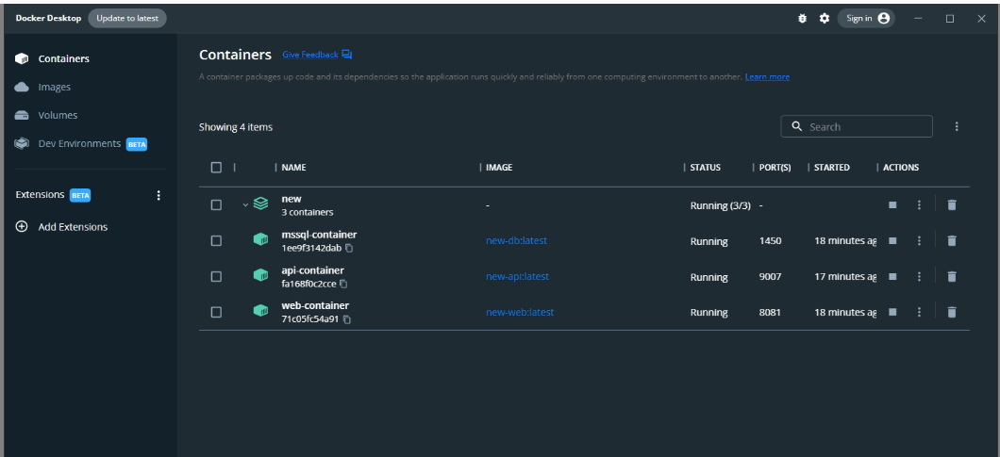
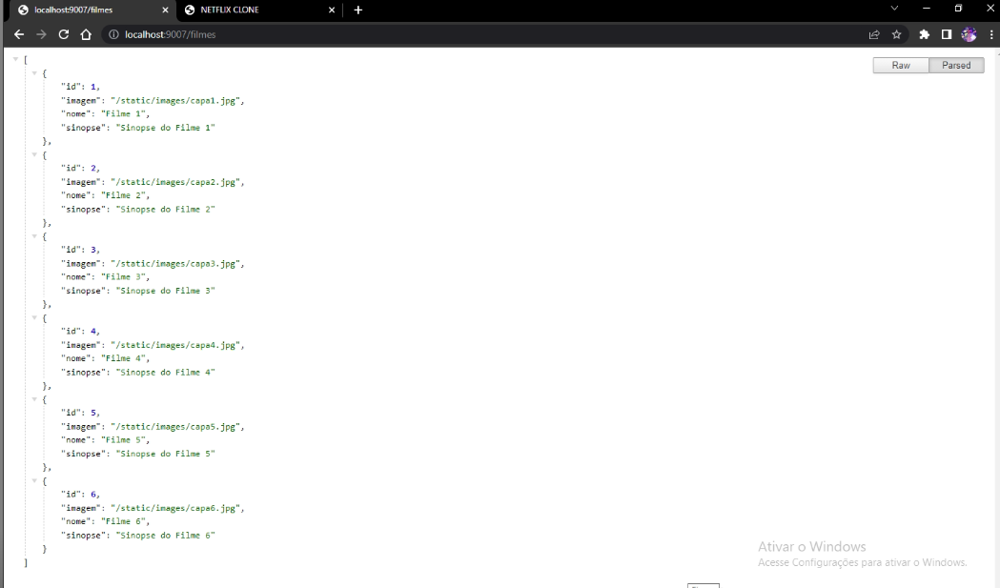
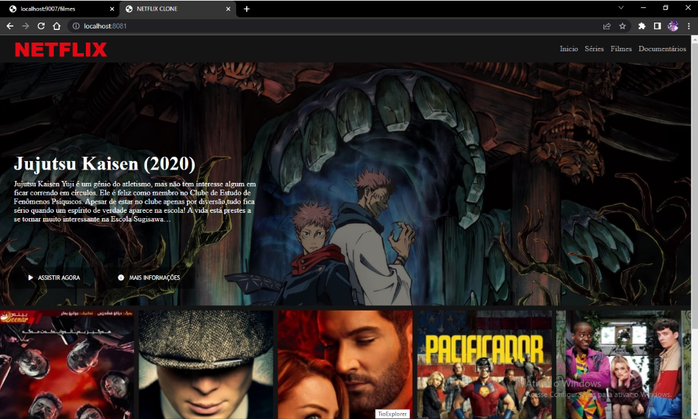

<h1 align="center">Criando um Container de uma
Aplicação WEB</h1>

  <a href="#open_book-sobre">Sobre</a>
  &nbsp;&nbsp;&nbsp;|&nbsp;&nbsp;&nbsp;
  <a href="#hammer-tecnologias">Tecnologias</a>
  &nbsp;&nbsp;&nbsp;|&nbsp;&nbsp;&nbsp;
  <a href="#rocket-resultado">Resultado</a>

## :open_book: Sobre
Neste projeto fui além e fiz alterações mais robustas em comparação ao desafio sujerido de "Criando um Container de uma Aplicação WEB", pois poderia ser feito da forma abaixo:
1. Criar um arquivo YML com as definições de um servidor Apache (httpd); 
2. Especificar no arquivo YML o local onde os arquivos da aplicação estarão. A aplicação pode ser um simples Hello World. 
3. Será que você consegue executar uma aplicação web completa? 
4. Subir o arquivo YML e a aplicação para um repositório no GitHub.

Então no caso foi criado um container com o site com flask que faz uma requisição a outro container que tem a api em flask também que se comunica com o container do banco de dados sql server e retorna uma lista de filmes cadastrados no banco.

## :hammer: Tecnologias
Este projeto foi feito com as seguintes tecnologias:
- HTML5
- CSS3
- JavaScript
- JQuery
- Python
- Flask
- SQL - SQL Server
- Docker

## :rocket: Resultado

  
  
  

